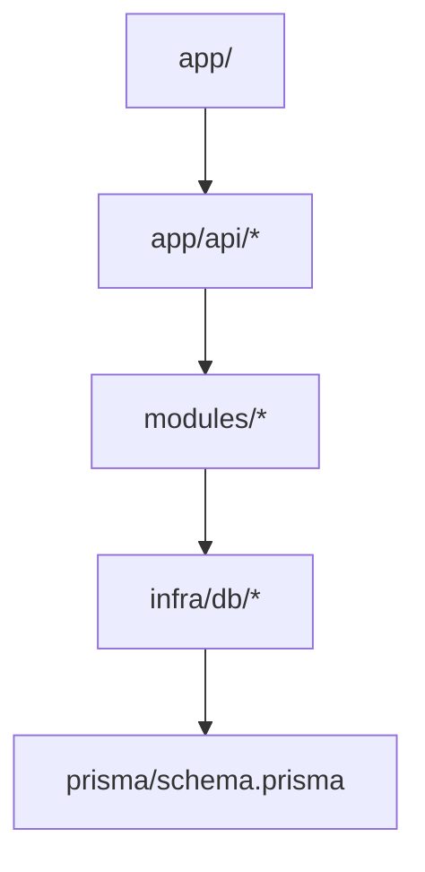

# Architecture

本專案以 Next.js App Router + Prisma（PostgreSQL）實作「wafer 工廠訂單排程系統」。

## Directory layout (current)

目前專案採「根目錄分層」（不是 `src/`）：

```text
wafer-fabrication-scheduling/
├── app/        # Presentation layer: UI + route handlers (API)
├── modules/    # Service/Domain layer: business logic
├── infra/      # Infra/Persistence layer: DB access, adapters
├── prisma/     # Prisma schema & migrations
└── lib/        # Shared utilities & generated code (e.g. prisma client output)
```

> 注意：`README.md` 內的 `src/*` 結構描述可能是預期目標；以實際目錄為準（`app/`, `modules/`, `infra/`）。

## Layering rules (high-level)

- **UI (app)**: 只處理 request/response、session/user context 取得、輸入驗證、mapping。
- **Business logic (modules)**: 角色/範圍判斷、狀態機、排程/衝突計算、交易一致性。
- **Infra (infra)**: Prisma client、repository、外部系統（Redis/Queue/Email...）。

推薦的依賴方向：



## Cross-cutting concerns

- **Auth & RBAC**: 在 `app/api/*` 入口處做「身份驗證 + 授權」；modules 仍需做「防禦性授權」（避免繞過 API）。
- **Validation**: request validation 建議用 `zod`（已在 dependencies）。
- **Observability**: 建議在 API 層做 request id、結構化 log；排程變更需記錄 version/audit（見 `docs/scheduling_conflicts.md`）。

## Key domain objects (as of Prisma)

以 Prisma schema 為準：
- `User { role: SUPERADMIN | ADMIN | SALES, group?: string }`
- `Factory { productionType: string, adminId?, status, maxCapacity, curCapacity }`
- `Order { status, dueDate, productionDate?, quantity, type, factoryId?, applicantId, lastModifiedById? }`
- `OrderRequest`（業務提出/修改申請）
- `OrderPermission`（針對 order 的細粒度授權）

參考：`prisma/schema.prisma`

