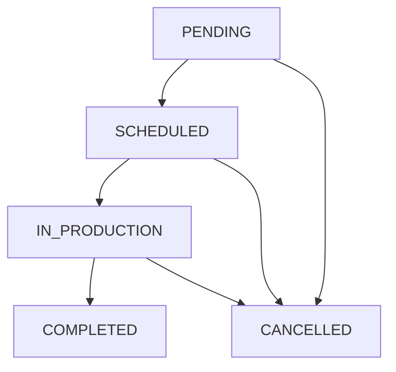

# Orders lifecycle

本文件定義 `Order` 的狀態機與可執行的操作邊界。

## Status enum (from Prisma / OpenAPI)

`OrderStatus`：
- `PENDING`
- `SCHEDULED`
- `IN_PRODUCTION`
- `COMPLETED`
- `CANCELLED`

## Recommended state transitions

限制（建議）：
- `COMPLETED` 不可回退
- `CANCELLED` 不可回退
- `productionDate` 只應在 `SCHEDULED` 之後才有值

## Who can do what

- **SALES**
  - 檢視（受 scope 限制）
  - 提交變更申請（`OrderRequest`），不直接改 order
- **ADMIN**
  - CRUD 該 factory 的 orders
  - 調整排程（會影響 `productionDate/status`）
- **SUPERADMIN**
  - 具備 ADMIN 全權 + 跨工廠/同 type 的分配

## Audit fields

Prisma fields：
- `Order.applicantId`: 原始提出者
- `Order.lastModifiedById`: 最後修改者（建議任何 write 都寫入）
- `createdAt/updatedAt`: 時間戳

> 若之後需要更完整稽核，建議新增 `OrderAuditLog`（非本次文件範圍）。

