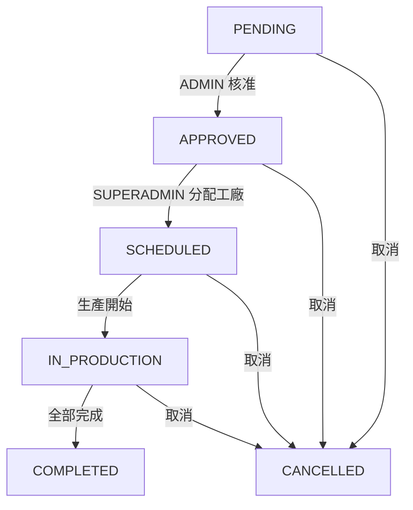

# Orders lifecycle

本文件定義 `Order` 的狀態機與可執行的操作邊界。

## Status enum (from Prisma / OpenAPI)

`OrderStatus`：
- `PENDING` — SALES 剛建立，可修改，等待 ADMIN 審核
- `APPROVED` — ADMIN 已核准，鎖定修改，進入待排程池
- `SCHEDULED` — SUPERADMIN 已建立 OrderAssignment，派工完成
- `IN_PRODUCTION` — 至少一張 OrderAssignment 進入生產
- `COMPLETED` — 所有 OrderAssignment 完成
- `CANCELLED`

## Recommended state transitions

限制：
- `COMPLETED` 不可回退
- `CANCELLED` 不可回退
- `OrderAssignment`（productionDate、factoryId）只在 `SCHEDULED` 之後才存在

## Who can trigger which transition

| 轉換 | 操作者 |
|---|---|
| PENDING → APPROVED | ADMIN（factory scope）|
| APPROVED → SCHEDULED | SUPERADMIN（建立 OrderAssignment）|
| SCHEDULED → IN_PRODUCTION | ADMIN / SUPERADMIN |
| * → CANCELLED | ADMIN / SUPERADMIN |

## Who can do what

- **SALES** — 檢視自己建立的訂單；提交變更申請（`OrderRequest`），不直接改 order
- **ADMIN** — 審核（PENDING → APPROVED）；管理已分配到其工廠的訂單與排程
- **SUPERADMIN** — 分配訂單給工廠（APPROVED → SCHEDULED）；type 範圍內完整權限

## Audit fields

Prisma fields：
- `Order.applicantId`: 原始提出者
- `Order.lastModifiedById`: 最後修改者（建議任何 write 都寫入）
- `createdAt/updatedAt`: 時間戳

> 若之後需要更完整稽核，建議新增 `OrderAuditLog`（非本次文件範圍）。

