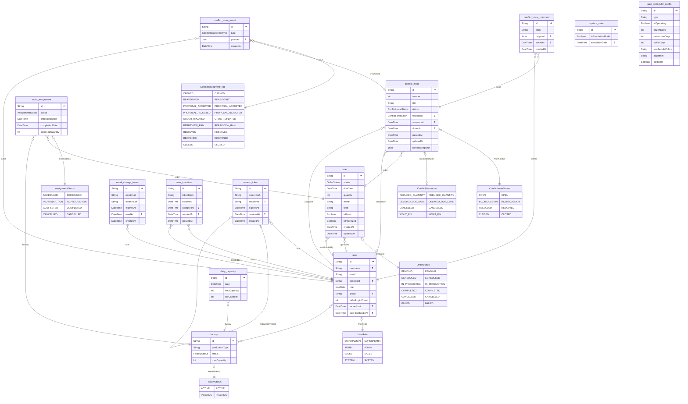

```mermaid
erDiagram

        UserRole {
            SUPERADMIN SUPERADMIN
ADMIN ADMIN
SALES SALES
SYSTEM SYSTEM
        }


        FactoryStatus {
            ACTIVE ACTIVE
INACTIVE INACTIVE
        }


        OrderStatus {
            PENDING PENDING
SCHEDULED SCHEDULED
IN_PRODUCTION IN_PRODUCTION
COMPLETED COMPLETED
CANCELLED CANCELLED
FAILED FAILED
        }


        AssignmentStatus {
            SCHEDULED SCHEDULED
IN_PRODUCTION IN_PRODUCTION
COMPLETED COMPLETED
CANCELLED CANCELLED
        }


        ConflictIssueStatus {
            OPEN OPEN
IN_DISCUSSION IN_DISCUSSION
RESOLVED RESOLVED
CLOSED CLOSED
        }


        ConflictResolution {
            REDUCED_QUANTITY REDUCED_QUANTITY
DELAYED_DUE_DATE DELAYED_DUE_DATE
CANCELLED CANCELLED
WONT_FIX WONT_FIX
        }


        ConflictIssueEventType {
            OPENED OPENED
REASSIGNED REASSIGNED
PROPOSAL_ACCEPTED PROPOSAL_ACCEPTED
PROPOSAL_REJECTED PROPOSAL_REJECTED
ORDER_UPDATED ORDER_UPDATED
REPREVIEW_RAN REPREVIEW_RAN
RESOLVED RESOLVED
REOPENED REOPENED
CLOSED CLOSED
        }

  "user" {
    String id "🗝️"
    String username "❓"
    String email
    String password "❓"
    UserRole role
    String group "❓"
    Int failedLoginCount
    DateTime lockedUntil "❓"
    DateTime lastFailedLoginAt "❓"
    }


  "email_change_token" {
    String id "🗝️"
    String newEmail
    String tokenHash
    DateTime expiresAt
    DateTime usedAt "❓"
    DateTime createdAt
    }


  "user_invitation" {
    String id "🗝️"
    String tokenHash
    DateTime expiresAt
    DateTime acceptedAt "❓"
    DateTime revokedAt "❓"
    DateTime createdAt
    }


  "refresh_token" {
    String id "🗝️"
    String tokenHash
    String sessionId "❓"
    DateTime expiresAt
    DateTime revokedAt "❓"
    DateTime createdAt
    }


  "factory" {
    String id "🗝️"
    String productionType
    FactoryStatus status
    Int maxCapacity
    }


  "daily_capacity" {
    String id "🗝️"
    DateTime date
    Int maxCapacity
    Int curCapacity
    }


  "order" {
    String id "🗝️"
    OrderStatus status
    DateTime dueDate
    Int quantity
    String name
    String type
    Boolean isFixed
    Boolean isPrioritized
    DateTime createdAt
    DateTime updatedAt
    }


  "order_assignment" {
    String id "🗝️"
    AssignmentStatus status
    DateTime productionDate
    DateTime completionDate
    Int assignedQuantity
    }


  "conflict_issue" {
    String id "🗝️"
    Int number
    String title
    ConflictIssueStatus status
    ConflictResolution resolution "❓"
    DateTime resolvedAt "❓"
    DateTime closedAt "❓"
    DateTime createdAt
    DateTime updatedAt
    Json contextSnapshot
    }


  "conflict_issue_comment" {
    String id "🗝️"
    String body
    Json proposal "❓"
    DateTime editedAt "❓"
    DateTime createdAt
    }


  "conflict_issue_event" {
    String id "🗝️"
    ConflictIssueEventType type
    Json payload "❓"
    DateTime createdAt
    }


  "system_state" {
    String id "🗝️"
    Boolean isSimulationMode
    DateTime simulationDate "❓"
    }


  "auto_scheduler_config" {
    String id "🗝️"
    String type
    Boolean isOperating
    Int frozenDays
    Int productionDays
    Int bufferDays
    String reschedulePolicy
    String algorithm
    Boolean splittable
    }

    "user" |o--|| "UserRole" : "enum:role"
    "user" o{--}o "factory" : ""
    "email_change_token" }o--|| user : "user"
    "user_invitation" }o--|| user : "user"
    "user_invitation" }o--|| user : "createdBy"
    "refresh_token" }o--|| user : "user"
    "refresh_token" |o--|o refresh_token : "replacedByToken"
    "factory" |o--|| "FactoryStatus" : "enum:status"
    "daily_capacity" }o--|| factory : "factory"
    "order" |o--|| "OrderStatus" : "enum:status"
    "order" }o--|| user : "applicant"
    "order" }o--|o user : "lastModifiedBy"
    "order_assignment" |o--|| "AssignmentStatus" : "enum:status"
    "order_assignment" }o--|| order : "order"
    "order_assignment" }o--|| factory : "factory"
    "conflict_issue" |o--|| "ConflictIssueStatus" : "enum:status"
    "conflict_issue" |o--|o "ConflictResolution" : "enum:resolution"
    "conflict_issue" }o--|| order : "order"
    "conflict_issue" }o--|| user : "createdBy"
    "conflict_issue" }o--|| user : "assignee"
    "conflict_issue_comment" }o--|| conflict_issue : "issue"
    "conflict_issue_comment" }o--|| user : "author"
    "conflict_issue_event" |o--|| "ConflictIssueEventType" : "enum:type"
    "conflict_issue_event" }o--|| conflict_issue : "issue"
    "conflict_issue_event" }o--|| user : "actor"
```
